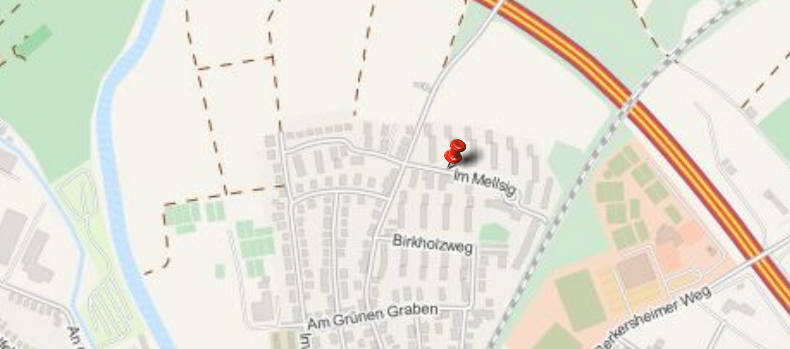

# pygpsplot

REST-server with python flask and smopy,
supply coordinates and get an image with a pin!

Sample query:

http://restserver:5000/v1/getimage?lat=50.166204&lon=8.658097&zoom=15&width=20&height=10&margin_lat=0.001&margin_lon=0.002
